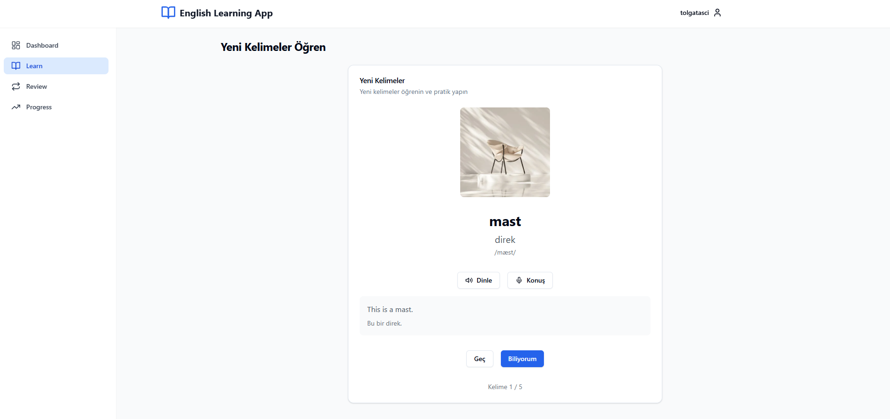

# English Learning App

Modern bir İngilizce öğrenme uygulaması. FastAPI ve MySQL kullanılarak geliştirilmiştir.



## ✨ Özellikler

🔄 **Spaced Repetition sistemi**
- Akıllı tekrar algoritması
- Kişiselleştirilmiş öğrenme deneyimi

📝 **Kelime öğrenme ve tekrar**
- Kapsamlı kelime veritabanı
- İnteraktif alıştırmalar

📊 **İlerleme takibi**
- Detaylı istatistikler
- Öğrenme analitiği

🎤 **Ses tanıma desteği**
- Telaffuz pratikleri
- Gerçek zamanlı geri bildirim

✅ **Quiz sistemi**
- Çeşitli soru tipleri
- Anlık performans değerlendirmesi

## 🚀 Kurulum

1. Gerekli paketlerin kurulumu:
```bash
pip install -r requirements.txt
```

2. MySQL kurulumu ve konfigürasyonu:
```bash
# MySQL kurulumu (Ubuntu için)
sudo apt-get install mysql-server
sudo mysql_secure_installation
```

3. Çevre değişkenlerinin ayarlanması:
```bash
cp .env.example .env
# .env dosyasını düzenleyin
```

4. Veritabanı kurulumu:
```bash
python setup.py
```

5. Uygulamayı başlatma:
```bash
uvicorn app.main:app --reload --log-level=debug

cd frontend
npm install
npm run dev
```

### Test
```bash
pytest
```

## API Dokümantasyonu

API dokümantasyonuna aşağıdaki URL'lerden erişebilirsiniz:
- Swagger UI: `http://localhost:8000/docs`
- ReDoc: `http://localhost:8000/redoc`

## Lisans

MIT License